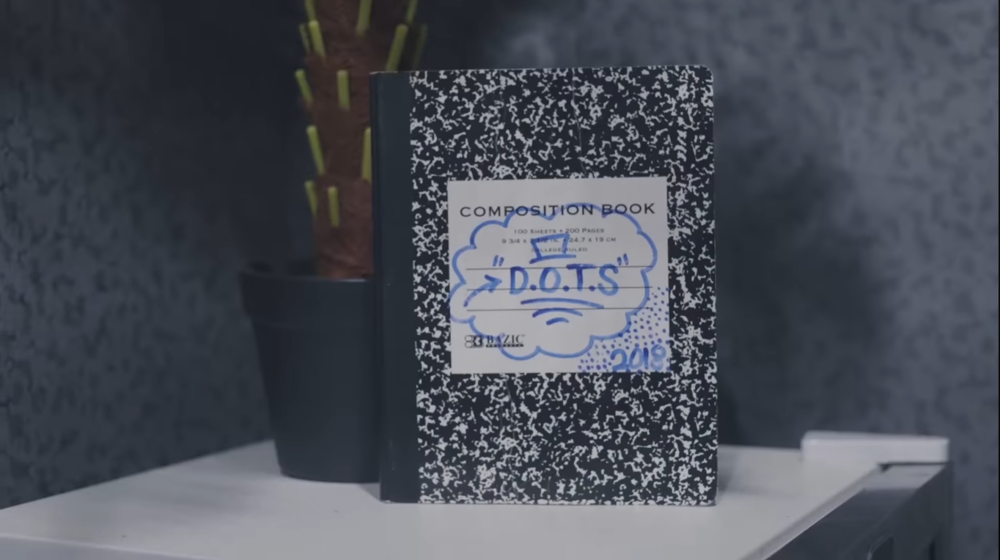

# Dotfiles

Personal shell configuration, synchronized across machines via cron.

## Philosophy: D.O.T.S.



**Don't Overthink This Shit.** Commands live in self-documenting modules, discoverable via the `dots` command. The system is intentionally simple — no framework, no magic, just zsh files with structured comment blocks.

## Directory Structure

```
shell/        Core startup files (init.zsh, path.zsh, dots.zsh)
modules/      Shared zsh modules loaded on all machines
machines/     Machine-specific config (personal, ibotta, unknown)
tools/        Standalone utility programs (Go binaries, etc.)
archive/      Deprecated configs kept for reference, not sourced
bin/          Compiled binaries (startup-message)
```

### modules/

Each `.zsh` file is a self-contained group of related shell functions and aliases. Every module must have a `# Commands:` block near the top — a series of comment lines describing each command. This block is parsed by the `dots` discovery system.

```zsh
# modules/example.zsh
# Brief description of the module

# Commands:
#   my-cmd <arg>    Do something useful
#   other-cmd       Another command
```

### machines/

Machine directories are named after logical profiles, not hostnames. Machine detection runs in `shell/init.zsh` and sets `$DOTFILES_MACHINE`.

| Profile    | Hostname pattern                |
|------------|---------------------------------|
| `personal` | `six`                           |
| `ibotta`   | Matches `^[A-Z]{1}[A-Z0-9-]+$` |
| `unknown`  | Fallback                        |

Each machine directory may contain: `init.zsh`, `path.zsh`, `aliases.zsh`, `gitconfig`, `Brewfile`, and a `modules/` subdirectory for machine-specific modules.

## The `dots` Command

`dots` surfaces available commands by parsing `# Commands:` blocks from all loaded modules.

```bash
dots                      # Overview: all groups and command counts
dots <group>              # Detail for one group (e.g. dots git)
dots --all                # Every command across all groups
dots --search <term>      # Search command descriptions
```

Modules from `modules/*.zsh` are always loaded. If `$DOTFILES_MACHINE` is set, `machines/$DOTFILES_MACHINE/modules/*.zsh` is also loaded.

## Adding Commands

1. Add a function or alias to an existing module (or create a new `.zsh` file in `modules/`).
2. Update the `# Commands:` block near the top of the file with a description.
3. Run `dots` to verify the command appears.

## Deprecating / Archiving Commands

To deprecate a command, remove it from the module and its `# Commands:` entry. If you want to keep it for historical reference, move the file (or relevant portion) to `archive/`. Files in `archive/` are never sourced.

## Cron Backup

`backup_dotfiles.sh` snapshots machine-specific files (Brewfile, gitconfig, etc.) and commits/pushes any changes to `main`.

```bash
# Example crontab entry
0 * * * * $HOME/repos/dotfiles/backup_dotfiles.sh
```

**Requirements for cron compatibility:**
1. Define `PATH` explicitly in the crontab — cron does not inherit the shell environment.
2. Use SSH-based GitHub access — credential helpers don't work in cron context.

## Go Startup Message

`tools/startup-message/` is a Go program that prints a message at shell startup. Build it with:

```bash
make            # builds bin/startup-message
make clean      # removes the binary
```

The binary is committed to `bin/` so it's available immediately without requiring a Go toolchain on the target machine.
